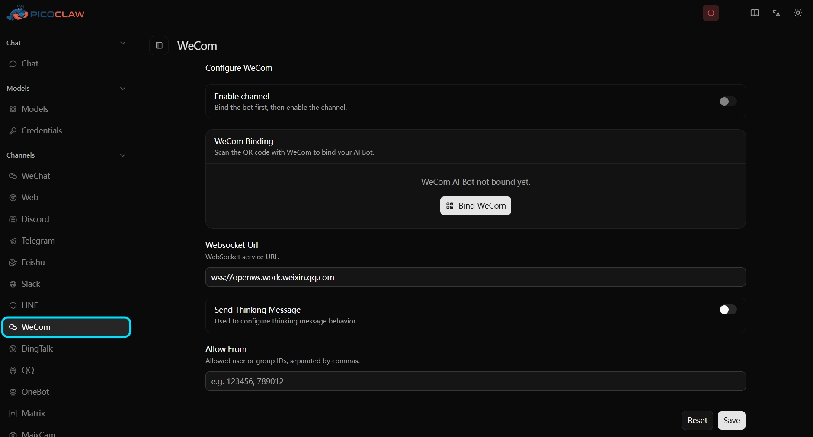

> Voltar ao [README](../../project/README.pt-br.md)

# WeCom

O PicoClaw expõe o WeCom como um único canal `channels.wecom`, construído sobre a API WebSocket oficial do WeCom AI Bot.
Isso substitui a antiga separação `wecom`, `wecom_app` e `wecom_aibot` por um modelo de configuração unificado.

> Nenhuma URL de callback webhook pública é necessária. O PicoClaw estabelece uma conexão WebSocket de saída para o WeCom.

## Funcionalidades Suportadas

- Chat direto e chat em grupo
- Respostas em streaming pelo protocolo WeCom AI Bot
- Mensagens recebidas: texto, voz, imagem, arquivo, vídeo e mensagens mistas
- Respostas enviadas: texto e mídia (`image`, `file`, `voice`, `video`)
- Onboarding por QR code via Web UI ou CLI
- Lista de permissões compartilhada e roteamento `reasoning_channel_id`

---

## Início Rápido

### Opção 1: Vinculação QR via Web UI (Recomendado)

Abra a Web UI, navegue até **Channels → WeCom** e clique no botão de vinculação QR. Escaneie o QR code com o WeCom e confirme no aplicativo — as credenciais são salvas automaticamente.

<p align="center">

</p>

### Opção 2: Login QR via CLI

Execute:

```bash
picoclaw auth wecom
```

O comando:
1. Solicita um QR code ao WeCom e o exibe no terminal
2. Também exibe um **Link do QR Code** que você pode abrir no navegador se o QR do terminal for difícil de escanear
3. Aguarda a confirmação — após escanear, você também deve **confirmar o login dentro do aplicativo WeCom**
4. Em caso de sucesso, grava `bot_id` e `secret` em `channels.wecom` e salva a configuração

O timeout padrão é de **5 minutos**. Use `--timeout` para estendê-lo:

```bash
picoclaw auth wecom --timeout 10m
```

> ⚠️ Escanear o QR code não é suficiente — você também deve tocar em **Confirmar** dentro do aplicativo WeCom, caso contrário o comando expirará.

### Opção 3: Configuração Manual

Se você já possui um `bot_id` e `secret` da plataforma WeCom AI Bot, configure diretamente:

```json
{
  "channel_list": {
    "wecom": {
      "enabled": true,
      "type": "wecom",
      "bot_id": "YOUR_BOT_ID",
      "secret": "YOUR_SECRET",
      "websocket_url": "wss://openws.work.weixin.qq.com",
      "send_thinking_message": true,
      "allow_from": [],
      "reasoning_channel_id": ""
    }
  }
}
```

---

## Configuração

| Campo | Tipo | Padrão | Descrição |
| ----- | ---- | ------ | --------- |
| `enabled` | bool | `false` | Ativar o canal WeCom. |
| `bot_id` | string | — | Identificador do WeCom AI Bot. Obrigatório quando ativado. |
| `secret` | string | — | Secret do WeCom AI Bot. Armazenado criptografado em `.security.yml`. Obrigatório quando ativado. |
| `websocket_url` | string | `wss://openws.work.weixin.qq.com` | Endpoint WebSocket do WeCom. |
| `send_thinking_message` | bool | `true` | Enviar uma mensagem `Processing...` antes do início da resposta em streaming. |
| `allow_from` | array | `[]` | Lista de permissões de remetentes. Vazio significa permitir todos os remetentes. |
| `reasoning_channel_id` | string | `""` | ID de chat opcional para rotear a saída de raciocínio para uma conversa separada. |

### Variáveis de Ambiente

Todos os campos podem ser substituídos via variáveis de ambiente com o prefixo `PICOCLAW_CHANNELS_WECOM_`:

| Variável de Ambiente | Campo Correspondente |
| -------------------- | -------------------- |
| `PICOCLAW_CHANNELS_WECOM_ENABLED` | `enabled` |
| `PICOCLAW_CHANNELS_WECOM_BOT_ID` | `bot_id` |
| `PICOCLAW_CHANNELS_WECOM_SECRET` | `secret` |
| `PICOCLAW_CHANNELS_WECOM_WEBSOCKET_URL` | `websocket_url` |
| `PICOCLAW_CHANNELS_WECOM_SEND_THINKING_MESSAGE` | `send_thinking_message` |
| `PICOCLAW_CHANNELS_WECOM_ALLOW_FROM` | `allow_from` |
| `PICOCLAW_CHANNELS_WECOM_REASONING_CHANNEL_ID` | `reasoning_channel_id` |

---

## Comportamento em Tempo de Execução

- O PicoClaw mantém um turno WeCom ativo para que as respostas em streaming possam continuar no mesmo fluxo quando possível.
- As respostas em streaming têm uma duração máxima de **5,5 minutos** e um intervalo mínimo de envio de **500ms**.
- Se o streaming não estiver mais disponível, as respostas recorrem à entrega por push ativo.
- As associações de rotas de chat expiram após **30 minutos** de inatividade.
- A mídia recebida é baixada para o armazenamento de mídia local antes de ser passada ao agente.
- A mídia enviada é carregada para o WeCom como um arquivo temporário e então enviada como uma mensagem de mídia.
- Mensagens duplicadas são detectadas e suprimidas (buffer circular dos últimos 1000 IDs de mensagens).

---

## Migração da Configuração Legada do WeCom

| Configuração anterior | Migração |
| --------------------- | -------- |
| `channels.wecom` (bot webhook) | Substituir por `channels.wecom` usando `bot_id` + `secret`. |
| `channels.wecom_app` | Remover. Usar `channels.wecom` no lugar. |
| `channels.wecom_aibot` | Mover `bot_id` e `secret` para `channels.wecom`. |
| `token`, `encoding_aes_key`, `webhook_url`, `webhook_path` | Não mais utilizados. Remover da configuração. |
| `corp_id`, `corp_secret`, `agent_id` | Não mais utilizados. Remover da configuração. |
| `welcome_message`, `processing_message`, `max_steps` | Não fazem mais parte da configuração do canal WeCom. |

---

## Solução de Problemas

### A vinculação QR expira

- Após escanear o QR code, você também deve **confirmar o login dentro do aplicativo WeCom**. Escanear sozinho não é suficiente.
- Execute novamente com um `--timeout` maior: `picoclaw auth wecom --timeout 10m`
- Se o QR code no terminal for difícil de escanear, use o **Link do QR Code** exibido abaixo dele para abrir no navegador.

### QR code expirado

- O QR code tem validade limitada. Execute novamente `picoclaw auth wecom` para obter um novo.

### Falha na conexão WebSocket

- Verifique se `bot_id` e `secret` estão corretos.
- Confirme que o host pode alcançar `wss://openws.work.weixin.qq.com` (WebSocket de saída, nenhuma porta de entrada necessária).

### As respostas não chegam

- Verifique se `allow_from` está bloqueando o remetente.
- Verifique se `channels.wecom.bot_id` e `channels.wecom.secret` estão definidos e não vazios.
